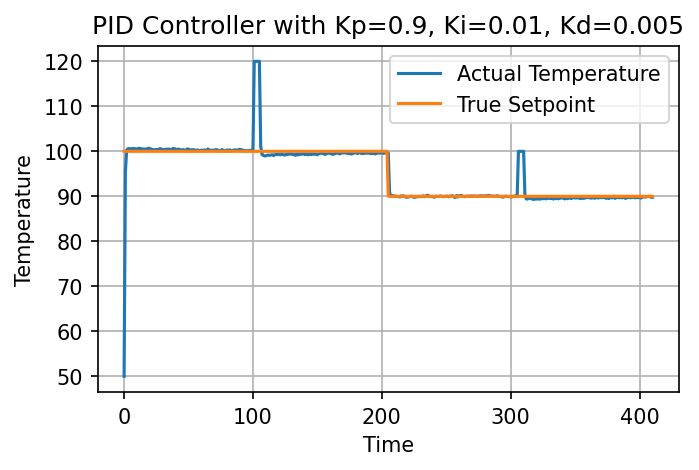
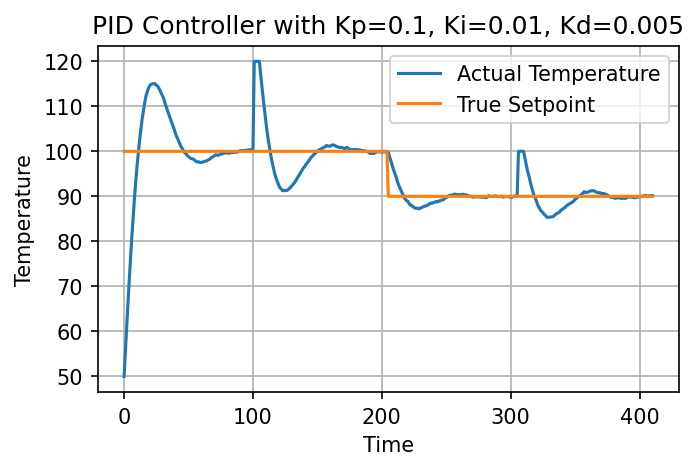
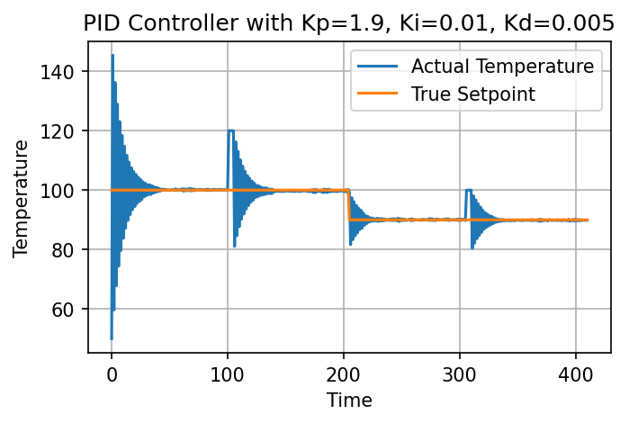
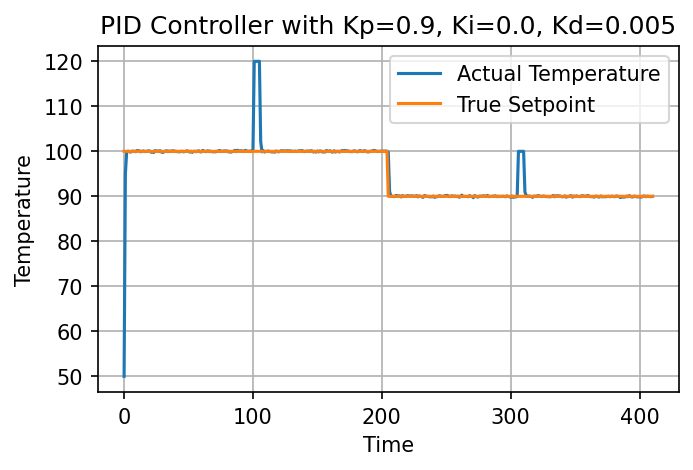
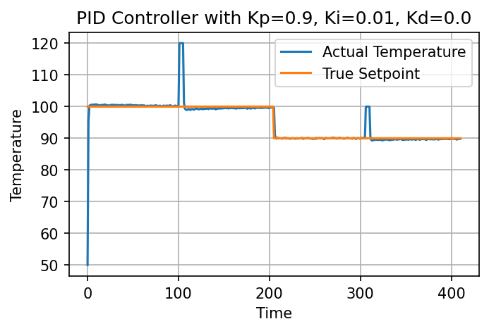

# PID Control Solutions

*Kevin Wu, Irene Madejski, Bayard Walsh*

`pid_control.ipynb` contains the solutions to the PID control problem.

`figures/` contains the figures generated by the notebook.

## Part 1: Implement PID Control

See the `Heating_Process.pid_controller` function in `pid_control.ipynb`.

``` python
def pid_controller(self):
    '''
    Main controller for the heating vessel.
    Parameters
    ----------
        None
    Returns
    -------
        final_control (float): Temperature response change from PID controller
    '''
    proportional = self.Kp*(self.sp_temp_list[-1]-self.temp_list[-1])
    integral = self.Ki*np.sum(np.array(self.sp_temp_list[self.iter_from:])-np.array(self.temp_list[self.iter_from:]))
    if len(self.temp_list) < 2:
        derivative = 0
    else:
        derivative = self.Kd*(self.temp_list[-1]-self.temp_list[-2])
    final_control = proportional + integral + derivative
    return final_control
```

## Part 2: Identify Ideal Control

See the plot below. One configuration that works well is $K_p = 0.9, K_i = 0.01, K_d = 0.005$. This configuration limits the overshoot and oscillation of the temperature and allows the temperature to reach the setpoint quickly. It also recovers from kicks quickly.



## Part 3: Aberrant Behavior

### Case 1: Lowering $K_p$

The proportional controller is relatively robust to lowering, since the integral and derivative controllers compensate for the lack of proportional responsiveness. Only when we lower it from $0.9$ to around $0.1$ does the system start to oscillate.

The proportional controller lags behind, so the integral controller is more pronounced since it accumulates the error. For example, at the start, the proportional controller goes from 0 to 100 slowly, so the accumulated error is a high positive value, which causes the initial overshoot.



### Case 2: Raising $K_p$

Raising it from $0.9$ to $1.9$ causes the system to oscillate extreme amounts at setpoint changes and kicks. The proportional controller is too responsive, so the system overshoots and oscillates quickly each time there is a significant change in the system, either a setpoint change or a kick.



### Case 3: Lowering $K_i$

Lowering the integral controller from $0.01$ all the way down to $0$ does not induce any aberrant behavior. The system is still able to reach the setpoint and recover from kicks. This shows the integral controller is not very important, as the other controllers can compensate for its absence.



### Case 4: Raising $K_i$

Raising the integral controller from $0.01$ to $0.5$ shows aberrant behavior only during dramatic changes in temperature. For example, even when the setpoint changes from 100 to 90, the actual temperature follows the setpoint well. But at the beginning and at the kicks, the system overshoots. This is because the accumulated error is higher in these moments, and a higher $K_i$ further accentuates the accumulated error.


### Case 5: Lowering $K_d$

Similar to lowering the integral controller, lowering the derivative controller from $0.005$ all the way down to $0$ does not induce any aberrant behavior. The system is still able to reach the setpoint and recover from kicks. This shows the derivative controller is not very important, as the other controllers can compensate for its absence.



### Case 6: Raising $K_d$

Raising the derivative controller from $0.005$ to $0.5$ causes the system to oscillate around setpoint changes and kicks. At these moments, the difference between the previous temperature and the current temperature is high because the proportional controller is responsive, with $K_p = 0.9$. The derivative controller is also responsive, so it further accentuates the difference between the previous temperature and the current temperature, causing the system to oscillate.


### Case 7: Lowering all $K_p, K_i, K_d$

We showed in case 3 and case 5 that lowering $K_i$ and $K_d$ does not induce any aberrant behavior. Thus, in this case we set them to 0 and lower $K_p$ from $0.9$ to $0$, essentially combining cases 1, 3, and 5. Now, we see that the system is too slow to respond. Each time there is a setpoint change or kick, the actual temperature gradually adjusts back to the setpoint.


### Case 8: Raising all $K_p, K_i, K_d$

When raising all three controllers from $0.9, 0.01, 0.005$ to $1.9, 0.5, 0.5$, essentially combining cases 2, 4, and 6, the system oscillates around the setpoint and kicks, which is also similar to the behavior in those cases. However, the oscillation is not as extreme as case 2, where only $K_p$ was raised. This is because the integral and derivative controllers are also more responsive, so they help dampen the oscillation.


