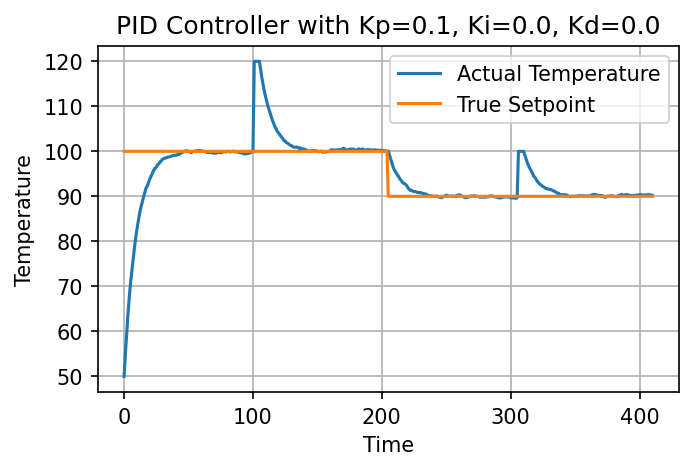

# PID Control Solutions and SDL Fruit Ninja Solutions

*Kevin Wu, Irene Madejski, Bayard Walsh*

`PID_Control/pid_control.ipynb` contains the solutions to the PID control problem.

`PID_Control/figures/` contains the figures generated by the notebook.

`SDL_Fruit_Ninja/Fruit_Ninja_Main.ipynb` contains the solutions to the Fruit Ninja problem.

`SDL_Fruit_Ninja/output/` contains the images and videos generated by the fruit ninja notebook.

## PID Control Part 1: Implement PID Control

See the `Heating_Process.pid_controller` function in `PIC_Control/pid_control.ipynb`.

``` python
def pid_controller(self):
    '''
    Main controller for the heating vessel.
    Parameters
    ----------
        None
    Returns
    -------
        final_control (float): Temperature response change from PID controller
    '''
    proportional = self.Kp*(self.sp_temp_list[-1]-self.temp_list[-1])
    integral = self.Ki*np.sum(np.array(self.sp_temp_list[self.iter_from:])-np.array(self.temp_list[self.iter_from:]))
    if len(self.temp_list) < 2:
        derivative = 0
    else:
        derivative = self.Kd*(self.temp_list[-1]-self.temp_list[-2])
    final_control = proportional + integral + derivative
    return final_control
```

## PID Control Part 2: Identify Ideal Control

See the plot below. One configuration that works well is $K_p = 0.9, K_i = 0.01, K_d = 0.005$. This configuration limits the overshoot and oscillation of the temperature and allows the temperature to reach the setpoint quickly. It also recovers from kicks quickly.


## PID Control Part 3: Aberrant Behavior

### Case 1: Lowering $K_p$

The proportional controller is relatively robust to lowering, since the integral and derivative controllers compensate for the lack of proportional responsiveness. Only when we lower it from $0.9$ to around $0.1$ does the system start to oscillate.

The proportional controller lags behind, so the integral controller is more pronounced since it accumulates the error. For example, at the start, the proportional controller goes from 0 to 100 slowly, so the accumulated error is a high positive value, which causes the initial overshoot.


### Case 2: Raising $K_p$

Raising it from $0.9$ to $1.9$ causes the system to oscillate extreme amounts at setpoint changes and kicks. The proportional controller is too responsive, so the system overshoots and oscillates quickly each time there is a significant change in the system, either a setpoint change or a kick.


### Case 3: Lowering $K_i$

Lowering the integral controller from $0.01$ all the way down to $0$ does not induce any aberrant behavior. The system is still able to reach the setpoint and recover from kicks. This shows the integral controller is not very important, as the other controllers can compensate for its absence.


### Case 4: Raising $K_i$

Raising the integral controller from $0.01$ to $0.5$ shows aberrant behavior only during dramatic changes in temperature. For example, even when the setpoint changes from 100 to 90, the actual temperature follows the setpoint well. But at the beginning and at the kicks, the system overshoots. This is because the accumulated error is higher in these moments, and a higher $K_i$ further accentuates the accumulated error.


### Case 5: Lowering $K_d$

Similar to lowering the integral controller, lowering the derivative controller from $0.005$ all the way down to $0$ does not induce any aberrant behavior. The system is still able to reach the setpoint and recover from kicks. This shows the derivative controller is not very important, as the other controllers can compensate for its absence.


### Case 6: Raising $K_d$

Raising the derivative controller from $0.005$ to $0.5$ causes the system to oscillate around setpoint changes and kicks. At these moments, the difference between the previous temperature and the current temperature is high because the proportional controller is responsive, with $K_p = 0.9$. The derivative controller is also responsive, so it further accentuates the difference between the previous temperature and the current temperature, causing the system to oscillate.


### Case 7: Lowering all $K_p, K_i, K_d$

We showed in case 3 and case 5 that lowering $K_i$ and $K_d$ does not induce any aberrant behavior. Thus, in this case we set them to 0 and lower $K_p$ from $0.9$ to $0$, essentially combining cases 1, 3, and 5. Now, we see that the system is too slow to respond. Each time there is a setpoint change or kick, the actual temperature gradually adjusts back to the setpoint.



### Case 8: Raising all $K_p, K_i, K_d$

When raising all three controllers from $0.9, 0.01, 0.005$ to $1.9, 0.5, 0.5$, essentially combining cases 2, 4, and 6, the system oscillates around the setpoint and kicks, which is also similar to the behavior in those cases. However, the oscillation is not as extreme as case 2, where only $K_p$ was raised. This is because the integral and derivative controllers are also more responsive, so they help dampen the oscillation.


## Fruit Ninja Part 1: Watermelon Particle filter
Note: the image paths for loading fruits and the background need to be adjusted for each computer.

See the `CrosshairsController.particle_filter` function in `SDL_Fruit_Ninja/Fruit_Ninja_Main.ipynb`.

``` python
def particle_filter(
        self,
        curr_image,
        curr_particles,
        curr_particle_weights,
        fruit,
        sigma=1.5,
    ):
        hitpoints = []

        f = getattr(self, f"{fruit}Found")

        # if fruit not found generate random search points
        if not f:
            setattr(
                self, f"{fruit.upper()}_particles", self.get_random_points(curr_image)
            )
        # if found resample points with sigma distribution and color weighting
        else:
            bestpart = getattr(self, f"{fruit.upper()}_particles")
            self.get_weights_from_points(curr_image, bestpart, fruit)
            setattr(
                self,
                f"{fruit.upper()}_particles",
                self.resample(curr_image, bestpart, fruit, sigma=sigma),
            )

        for (x, y) in curr_particles:
            attr = f"{fruit}_color_gen"
            r, g, b = curr_image[y, x]
            dist = getattr(self, attr)[r, g, b]
            if (
                dist == 1
            ):  # only take average of "good points" (in fruit and not in background)
                hitpoints.append((x, y))

        if len(hitpoints) != 0:
            match fruit:
                case "w":
                    self.wFound = True
                    self.wBestP.append(np.round(np.mean(hitpoints, axis=0)).astype(int))
                case "o":
                    self.oFound = True
                    self.oBestP.append(np.round(np.mean(hitpoints, axis=0)).astype(int))
                case "s":
                    self.sFound = True
                    self.sBestP.append(np.round(np.mean(hitpoints, axis=0)).astype(int))
```

The particle filter first generates random search points, this continues until a fruit instance is identified by pixel color. Once the fruit is identified, points are resampled based on the sigma distribution and color weighting. Color weighting is determined by whether or not a pixel color is in the fruit, not in the background, or neither. The center fruit point is determined based on the average of pixels that are identified as in the fruit by pixel color. 

## Fruit Ninja Part 2: All Fruit Particle Filter
The output game play in `SDL_Fruit_Ninja/vids/particle_filter.mp4` demonstrates all fruit particle filters working simultaneously. The red particles correspond to the strawberry particle filter, the green particles correspond to the orange particle filter, and the blue particles correspond to the watermelon particle filter. The crosshairs are not moving in this game. 

Notice that particles are originally randomly distributed across the screen. As fruits are identified, the particle filter distribution concentrates at the locaiton of fruit-colored pixels, with a distribution determined by sigma. As fruits are killed, the random search process and resampling is repeated. 

<video width="600" controls>
  <source src="SDL_Fruit_Ninja/vids/particle_filter.mp4" type="video/mp4">
  Example fruit ninja play
</video>

## Fruit Ninja Part 3: Sigma Value Experimentation
Varying the sigma value, particle drift per frame, changes the range of the distribution of points around the fruit. A smaller sigma value means a larger distribution of particles, while a larger sigma value means the particles are more concentrated around the center of the fruit. Some benefits of a smaller sigma are preventing the cursor from getting stuck on background points with a pixel that has a color within a fruit, and allows for a better search for a more accurate location of the center. In contrast, a larger sigma allows for a more precise center location. 

Ultimately, a middle ground sigma value of around 1.5 allows for the benefits of both precision and accuracy, and optimizing the search process for the fruit center so that the trajectory can be successfully calculated. 

<video width="600" controls>
  <source src="SDL_Fruit_Ninja/vids/sigma0p5.mp4" type="video/mp4">
  Example fruit ninja play with sigma of 0.5
</video>
Example fruit ninja play with sigma of 0.5. Particle filter distribution is much larger than the size of the fruit once the fruit is located. Performance seems slightly hindered because center not sufficiently located.

<video width="600" controls>
  <source src="SDL_Fruit_Ninja/vids/out.mp4" type="video/mp4">
  Example fruit ninja play with sigma of 1.5
</video>
Example fruit ninja play with sigma of 1.5. Particle filter distribution is around center of fruit once the fruit it located. 

<video width="600" controls>
  <source src="SDL_Fruit_Ninja/vids/sigma5.mp4" type="video/mp4">
  Example fruit ninja play with sigma of 5
</video>
Example fruit ninja play with sigma of 5. Particle filter distribution is very concentrated and bouncing around the inside of the fruit once the fruit it located. Performance seems slightly hindered because, similarly, center not sufficiently located.


We also varied the amount of pixels in terms of random search and sample space. Our baseline was 1000 samples for random search and 500 samples for bounded search.

<video width="600" controls>
  <source src="SDL_Fruit_Ninja/vids/search75sample50.mp4" type="video/mp4">
  Example fruit ninja play with small particle sample spaces (75 search 50 sample).
</video>
Example fruit ninja play with small particle sample spaces. 39 second runtime.

<video width="600" controls>
  <source src="SDL_Fruit_Ninja/vids/search1000sample500.mp4" type="video/mp4">
  Example fruit ninja play with medium particle sample spaces (1000 search 500 sample).
</video>
Example fruit ninja play with medium particle sample spaces. 44 second runtime.

<video width="600" controls>
  <source src="SDL_Fruit_Ninja/vids/search1500sample750.mp4" type="video/mp4">
  Example fruit ninja play with large particle sample spaces (1500 search 750 sample).
</video>
Example fruit ninja play with large particle sample spaces. 47 second runtime.

Note that with increasing the pixel number more, we get better accuracy with a longer runtime. However, even with a far lower number of particles the model still tracks very well, and often picks up on the fruit when it initially enters the frame and doesn't lose the fruit on sucessive samples. Therefore our baseline was probably too high, and we could have achieved similar performance with lower points, but that would be a design consideration for larger scaling particle filters.


## Fruit Ninja Part 4: Crosshair Coordinate Decision
See the `CrosshairsController.calculate_next_cursor_position` function in `SDL_Fruit_Ninja/Fruit_Ninja_Main.ipynb`.

``` python
def calculate_next_cursor_position(
        self, cursor_pos, object_pos, cursor_speed, time_step=1
    ):
        cursor_pos = np.array(cursor_pos)
        object_pos = np.array(object_pos)
        direction_vector = object_pos - cursor_pos
        distance_to_object = np.linalg.norm(direction_vector)
        if distance_to_object <= cursor_speed * time_step:
            return tuple(object_pos)
        direction_vector_normalized = direction_vector / distance_to_object
        new_cursor_pos = (
            cursor_pos + direction_vector_normalized * cursor_speed * time_step
        )

        return tuple(new_cursor_pos)
```
The calculate_next_cursor_position function calculates the next position of the cursor by moving towards a given chosen fruit. When the first fruit appears on the screen, this is chosen as the initial target, and the cursor moves towards this fruit until the fruit is killed or dropped from the screen. A new target is chosen based on the closest fruit to the cursor.

The cursor is moved closer towards the chosen fruit by determining the next position of the fruit after one time step and moving towards that direction. The next position of the fruit after one time step is determined by fitting the previous point averages centers to a parabolic curve and using the determined curve to find the next location of the fruit. The fitting is done after every time step to increase the accuracy of the trajectory.

Further improvement on the game play could optimize this process further. Given that the fitted parabolic curve gives the total trajectory, this could be used to predict which is the closest next fruit to hit at a certain time step. 

## Fruit Ninja Part 5: Game-Play Performance Demonstration
See the videos below for a demonstration of our controller with the particle filter and crosshair controller as compared to the performance of stagnant crosshairs. Our controller performances better; at 10 seconds, our controller had a score of 12 while the stagnant crosshairs game had a score of 3 at 10 seconds. 

<video width="600" controls>
  <source src="SDL_Fruit_Ninja/vids/out.mp4" type="video/mp4">
  Example fruit ninja play with particle filter crosshairs controller
</video>
Example fruit ninja play with particle filter crosshairs controller.

<video width="600" controls>
  <source src="SDL_Fruit_Ninja/vids/stagnant_crosshairs.mp4" type="video/mp4"> 
  Example fruit ninja play with stagnant crosshairs
</video>
Example fruit ninja play with stagnant crosshairs.

## Fruit Ninja Part 6: Crosshair Speed Experimentation
Varying the crosshair speed very clearly changes the performance of the controller with the particle filter and crosshair controller. A slower crosshair controller (max speed of 5) attempts to go towards many of the fruits but misses most of them because they move much faster than the controller. The medium speed crosshair controller (max speed of 20) goes towards many of the fruits and gets some, but also misses some. The fast speed crosshair controller (max speed of 50) goes quickly towards the fruits and gets most. This serves as proof that the trajectory prediction is pretty good but possibly the cursor movement choice could be optimized, but also is relatively capped in perfomrance by speed. 

<video width="600" controls>
  <source src="SDL_Fruit_Ninja/vids/cursor5.mp4" type="video/mp4">
  Example fruit ninja play with cursorspeed of 5. 
</video>
Example fruit ninja play with cursorspeed of 5 . Crosshair controller does badly, misses most fruit, and scores 3.

<video width="600" controls>
  <source src="SDL_Fruit_Ninja/vids/cursor20.mp4" type="video/mp4">
  Example fruit ninja play with cursorspeed of 20. 
</video>
Example fruit ninja play with cursorspeed of 20. Crosshair controller does well, misses some fruit, and scores 12.

<video width="600" controls>
  <source src="SDL_Fruit_Ninja/vids/cursor50.mp4" type="video/mp4">
  Example fruit ninja play with cursorspeed of 50. Crosshair controller does very well, almost misses no fruit, and scores 42.
</video>
Example fruit ninja play with cursorspeed of 50. Crosshair controller does very well, almost misses no fruit, and scores 42.